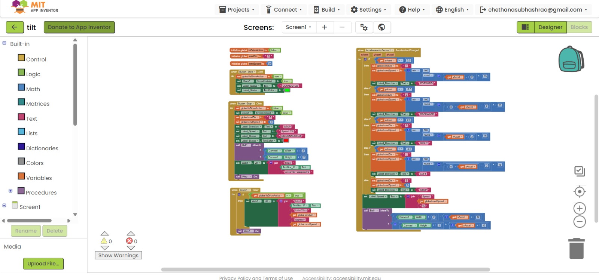
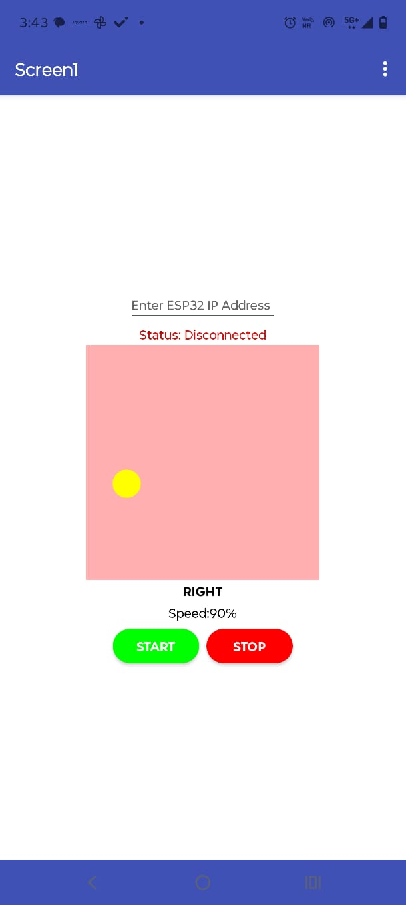
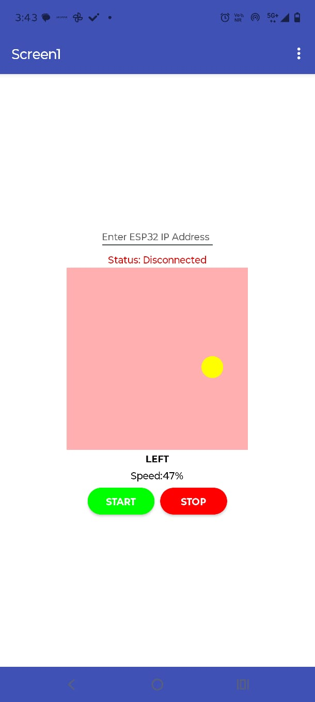

# Accelerometer-Based Motion Control Robot

A gesture-controlled robot built as part of IEEE CASS Summer of Projects 2026 at BMSIT.

## Overview

This robot is controlled by tilting a smartphone instead of using buttons or a joystick.

The phone's built-in accelerometer detects the tilt, and an MIT App Inventor app converts the tilt into movement commands and speed values.

The commands are sent over Wi-Fi to an ESP32, which controls the motors through an L298N motor driver.

## How It Works

The system follows:

**Tilt → Sense → Calculate → Send → Move → Repeat**

1. The phone's accelerometer detects its X and Y tilt values.
2. The MIT App Inventor app determines the movement direction.
3. The app calculates the speed based on the amount of tilt.
4. The command is sent to the ESP32 through Wi-Fi.
5. The ESP32 controls the motors through the L298N motor driver.
6. The robot moves according to the phone's tilt.

## Hardware

- ESP32-S3-CAM
- L298N Motor Driver
- 2 × DC Gear Motors
- Caster Wheel
- Robot Chassis
- 3 × 3.7V Batteries
- Jumper Wires
- Smartphone

## Components & Connections

### ESP32-S3-CAM → L298N

| ESP32 Pin | L298N Pin | Purpose |
|-----------|-----------|---------|
| GPIO 1 | ENA | PWM Speed Control Motor A |
| GPIO 2 | IN1 | Motor A Direction 1 |
| GPIO 3 | IN2 | Motor A Direction 2 |
| GPIO 14 | IN3 | Motor B Direction 1 |
| GPIO 41 | IN4 | Motor B Direction 2 |
| GPIO 42 | ENB | PWM Speed Control Motor B |

## MIT App Inventor Controller

The controller app contains:

- Status indicator
- Tilt visualizer
- START button
- STOP button
- AccelerometerSensor
- Web component
- Clock component

The tilt visualizer provides live feedback by moving according to the phone's tilt.

The app is set to **Portrait** orientation so the interface does not rotate while the phone is being tilted.

## Control Logic

| Phone Tilt | Robot Movement |
|------------|----------------|
| Tilt Forward | Move Forward |
| Tilt Backward | Move Backward |
| Tilt Left | Turn Left |
| Tilt Right | Turn Right |
| Little or No Tilt | Stop |
 

The speed changes according to the amount of phone tilt.

## Communication

The MIT App Inventor app sends HTTP GET requests to the ESP32 using the format:

`/drive?dir=X&speed=Y`

The ESP32 receives the direction and speed, converts the speed percentage into a PWM value, and controls the two motors.
## 📱 MIT App Inventor App

The MIT App Inventor source project is available here:

👉 [Download the `.aia` project](code/tilt.aia)

### 🖥️ App Interface
<table>
  <tr>
    <td></td>
    <td></td>
 
  </tr>
</table>

## Differential Steering

The robot uses differential steering for turns.

Instead of spinning the robot in place, the inside wheel is slowed down while the outside wheel continues moving faster.

This allows smoother turns.

## Software

- MIT App Inventor
- Arduino IDE
- ESP32 board support
- C/C++
- Wi-Fi
- HTTP

## Project Photos

<table>
  <tr>
    <td></td>
    <td></td>
    <td></td>
  </tr>
</table>

## What I Learned

- Smartphone accelerometer basics
- X, Y and Z axis values
- Tilt-based motion control
- MIT App Inventor
- HTTP GET requests
- Wi-Fi communication
- ESP32 motor control
- PWM speed control
- Differential steering
- Real-time robot control

## Project Outcome

Successfully built a robot that can be controlled by tilting a smartphone.

The phone detects its tilt, the MIT App Inventor app converts it into movement commands, and the ESP32 controls the robot motors through Wi-Fi.

## Future Improvements

- Improve tilt-to-speed calibration
- Make movement more responsive
- Add smoother acceleration and deceleration
- Improve the tilt visualizer
- Add adjustable sensitivity
